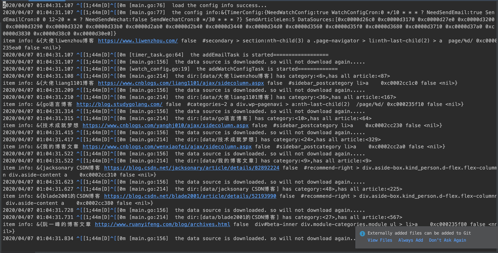
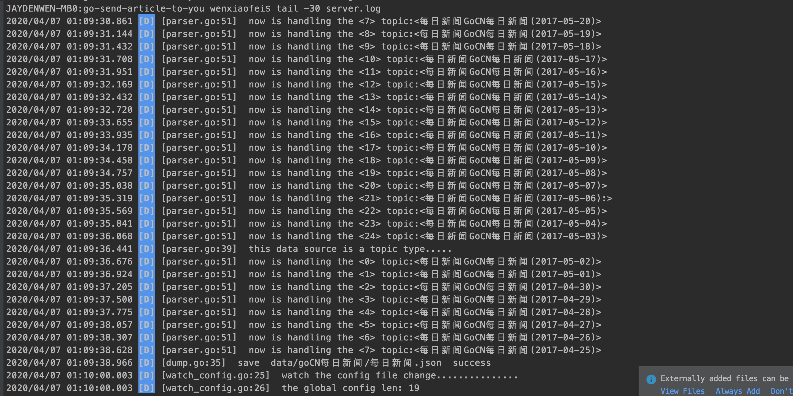
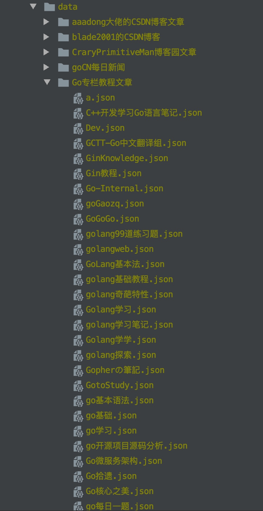
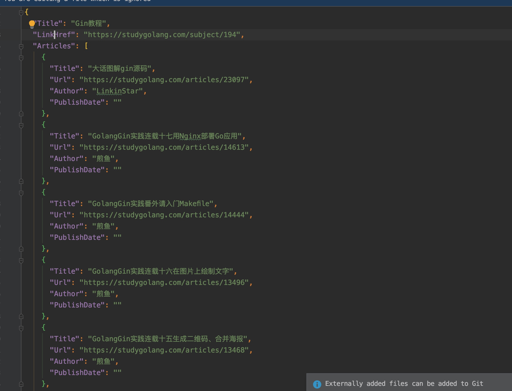
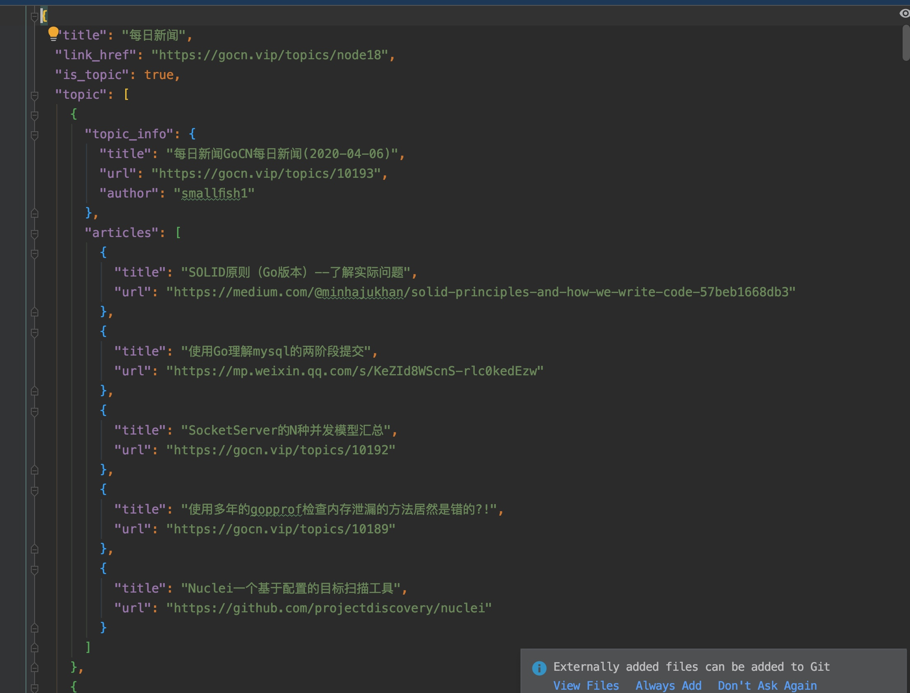

# 项目说明
>本项目主要功能是通过收集各大网站的技术文章，然后通过邮件或者微信的方式分享给你

## 项目ieda来源
> 作为一名技术爱好者，每天都会抽上下班、午休的时间逛逛掘金、微信公众号等平台阅读技术文章，因此萌生了这个想法，每天给自己定时推送优秀大佬的技术博客文章，方便学习

**特别说明：本项目已开源，该项目主要用来技术交流和学习，切不可用于商业用途，否则后果自负**

## 效果展示 
### 本地加载数据

### 收集远程数据


### 本地保存


### 收集栏目->文章数据

### 收集栏目->主题->文章数据


## 项目说明
### **目前该项目有两个分支：**  
1. `master分支`：采用golang自身内置的channel管道作为生产者和消费者的桥梁  
2. `msgQueue_kafka分支`：采用本地的kafka消息队列来存储数据，作为消费者和生产者的中间管道  

### **项目已实现的功能：**  

	* 数据源可配置
	* 数据源支持模板
	* 配置数据热更新
	* 定时发送邮件
	* 数据保存本地
	* 已下载数据从本地读取
	* 栏目->文章类型的网站数据收集
	* 栏目->主题->文章类型的网站数据收集
	* 启动、停止、重启、日志等自动化管理


## 使用姿势
	1.clone本仓库  
	``` shell
	git clone https://github.com/jaydenwen123/go-send-article-to-you.git
	```
	2.进入项目目录
	``` shell
	cd go-send-article-to-you
	```   
	3.执行启动脚本
	``` shell
	./start.sh
	```   

## 配置参数说明
```json
{
  "data_source_name": "goCN每日新闻",
  "data_srouce_url": "https://gocn.vip/",
  "category_selector": "#main > div.hide-ios > div > div > div:last-child  div.text a",
  "page_count_selector": "#main > div > div.col-md-9 > div > div.card-footer.clearfix > ul > li:nth-last-child(2) > a",
  "category_url_prefix": "https://gocn.vip",
  "page_format": "?page=%d",
  "is_topics": true,
  "topic_config": {
    "topic_block_selector": "#main > div > div.col-md-9 > div > div.card-body.item-list > div",
    "topic_link_selector": "div.infos > div.title > a",
    "topic_title_selector": "",
    "topic_link_prefix": "https://gocn.vip",
    "has_date": false,
    "date_selector": "",
    "has_author": true,
    "author_selector": "div  div.infos > div.info > a"
  },
  "article_config": {
    "article_block_selector": "#main > div > div.col-md-9 > div.topic-detail.card > div.card-body.markdown.markdown-toc > ol li",
    "article_link_selector": "a",
    "article_title_selector": ".",
    "article_link_prefix": "",
    "has_date": false,
    "date_selector": "",
    "has_author": false,
    "author_selector": ""
  }
}
```

### 数据源基本配置参数说明
1. **data\_source\_name:**  自己起一个数据源名称，该名称用来保存到本地时对应为一个目录    
2. **data\_srouce\_url:** 当前数据源的url，一般为一个要收集数据的网站链接  
3. **category\_selector:** 栏目的选择器，该参数主要用来确定栏目的区域，每个栏目一般都是一个超链接，即对应html为a标签，因此此处的选择器是需要定位到a标签，一般多个栏目的话，选择器确定的是多个a标签，也就是数组  
4. **page\_count\_selector:** 该参数主要确定每个栏目点击进去后的分页，获取总的分页数，底层获取分页数是通过获取该选择器定位到的元素内部的文本，然后再转成总页数  
5. **category\_url\_prefix:** 由于有些网站的栏目是采用的相对路径，因此如果要收集数据的话，需要全路径，故在栏目采用相对路径的情况下，需要指定栏目的url前缀，如果栏目本身采用的是全路径，则此处为空即可  
6. **page\_format:** 分页的url格式，有些网站时采用http://xxxx/page/2，有些网站是采用http://xxxx?page=2,所以此处需要指定分页格式，其中页数`务必`用%d替代  
7. **is\_topics:** 判断是否是主题，如goCN网站中的每日新闻，点击进去其实每一个都是对应为一个主题，文章具体信息还需要进入每个主题才能获取，此时需要设置is_topics为true，并配置主题的配置信息  

### 主题配置参数说明
1. **topic\_block\_selector:** 主题块选择器，也是对应的一个html元素列表
2. **topic\_link\_selector:**主题块下面的单个主题超链接选择器(html a标签)，
3. **topic\_title\_selector:**主题的标题选择器（如果有时则会采用该选择器获取文本作为标题）如果使用`.`则将单个主题块下的文本作为标题
4. **topic\_link\_prefix:**主题的超链接的前缀，有些网站采用的是相对路径，此时需要指定该参数
5. **has\_date:** 是否有日期信息，如果该参数为true，则需要指定`date_selector`日期选择器
6. **date\_selector:**日期选择器，当`has_date`为true时指定该参数
7. **has\_author:**是否有作者信息，当该值为true时，需要指定`author_selector`作者选择器
8. **author\_selector:**作者选择器，当`has_author`为true时，指定该参数


### 文章配置参数说明
1. **article\_block\_selector:** 文章块选择器，也是对应的一个html元素列表
2. **article\_link\_selector:**文章块下面的单个文章超链接选择器(html a标签)，
3. **article\_title\_selector:**文章的标题选择器（如果有时则会采用该选择器获取文本作为标题）如果使用`.`则将单个文章块下的文本作为标题
4. **article\_link\_prefix:**文章的超链接的前缀，有些网站采用的是相对路径，此时需要指定该参数
5. **has\_date:** 是否有日期信息，如果该参数为true，则需要指定`date_selector`日期选择器
6. **date\_selector:**日期选择器，当`has_date`为true时指定该参数
7. **has\_author:**是否有作者信息，当该值为true时，需要指定`author_selector`作者选择器
8. **author\_selector:**作者选择器，当`has_author`为true时，指定该参数

## 模板说明
> 为了减轻配置或操作，本项目支持数据源配置模板的功能，用户只需简单的配置几个参数，就可以收集指定网站的文章内容

### 已支持模板
1. **go语言中文网的模板**
2. **CSDN模板**
3. **博客园模板**

### 模板使用说明
> 使用模板时需要注意以下事项   
> 1. user_template参数设置为true  
> 2. template_type参数可选值为：指定值，详细参数取值如下  

```go
	//csdn模板
	TemplateType_CSDN TemplateType = "csdn"
	//blog模板
	TemplateType_BLOG TemplateType = "blog"
	//go语言中文网模板
	TemplateType_GOWEB TemplateType = "go_web"
```

> 3. 采用blog模板时，data_srouce_url只需要指定用户名即可
> 4. 采用csdn模板时，data_srouce_url只需填任意的一篇博客文章链接即可，例如https://blog.csdn.net/jacksonary/article/details/82892224

#### CSDN模板 
**数据源配置项** 
 
``` json

	//blog模板
	{
      "data_source_name": "大佬liang1101博客",
      "data_srouce_url": "liang1101",
      "user_template": true,
      "template_type": "blog"
	},
	//csdn模板
	{
      "data_source_name": "xxx CSDN博客",
      "data_srouce_url": "https://blog.csdn.net/jacksonary/article/details/82892224",
      "user_template": true,
      "template_type": "csdn"
   },
   //go中文网模板
   {
      "data_source_name": "Go专栏教程文章",
      "data_srouce_url": "https://studygolang.com/?tab=subject",
      "user_template": true,
      "template_type": "go_web"
    }
    
```

`user_template:`:使用模板   
`template_type:`:模板类型   
